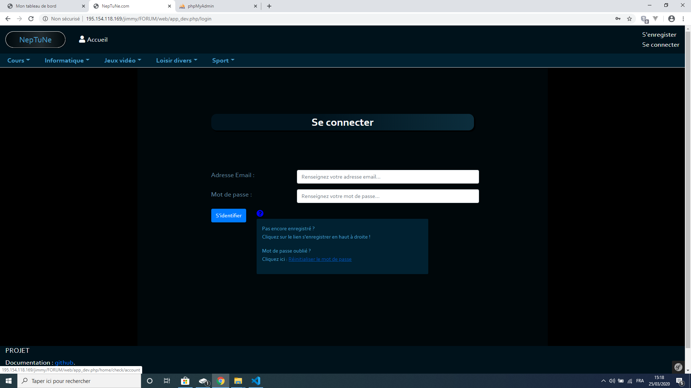

Premiers pas
============

******************
Création du compte
******************

Remplir tous les champs demandés sur la page de création du compte :

.. image:: ./NepTuNe/Register/img1.png

Une fois les champs renseignés, un email vous sera envoyé sur l'email que vous avez renseigné(e) afin d'activer votre compte.

*********
Connexion
*********

Dès que votre compte sera activé vous aurez la possibilité de vous connecter sur le site. 
Saisissez vos identifiants de connexion et cliquez sur le bouton "s'identifier".

.. image:: ./NepTuNe/Account/img1.png

.. note:: Le point d'interrogation présent sur la page de connexion vous aidera à modifier votre mot de passe en cas d'oubli.

Lors de la modification du mot de passe, vous devrez renseigner votre adresse email associée à votre compte utilisateur. Un email vous sera alors envoyé pour recevoir un nouveau mot de passe.

