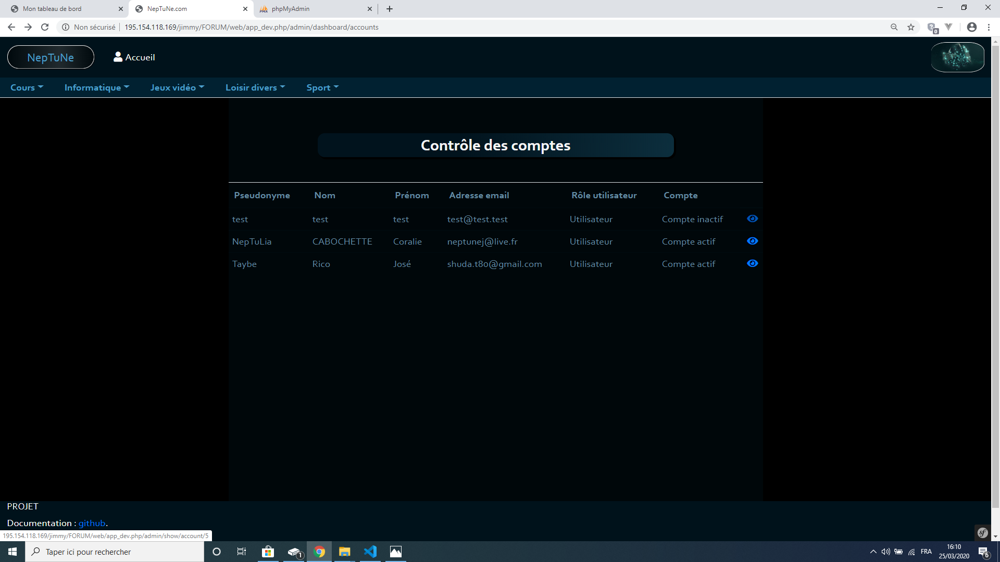
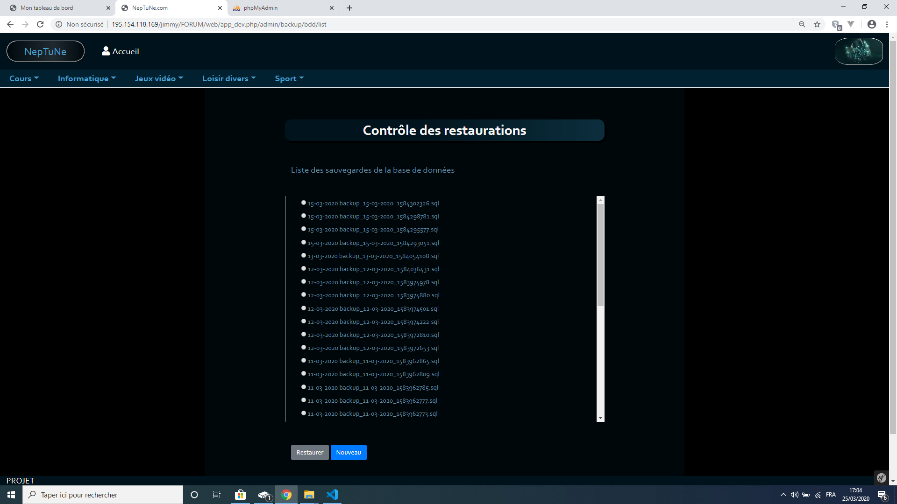

Administration et modération
============================

**********************
Administration du site
**********************

L'Administration du site est accessible, si l'utilisateur dispose du rôle administrateur, dans la fenêtre qui permet d'accéder à l'espace "Mon compte".
Cette fenêtre est accessible en cliquant sur l'image en haut à droite de l'écran dans le bandeau de navigation principal.

.. image:: ./NepTuNe/Admin/Dashboard/img1.png

Une fois l'option "Administration" sélectionner une nouvelle fenêtre apparaît. 
Celle-ci vous permet d'accéder aux

* Contrôle global du forum
* Contrôle des commentaires signalés (éléments supects)
* Contrôle des comptes utilisateurs
* Contrôle des sauvegardes du site

.. image:: ./NepTuNe/Admin/Dashboard/img2.png

#################
Contrôle du forum
#################

Le contrôle du forum permet à l'administrateur de créer des univers.
En cliquant sur le bouton "nouveau" l'administrateur peut saisir le libellé du nouvel univers.

.. image:: ./NepTuNe/Admin/Forum/img1.png

L'univers apparaîtra alors, après validation, dans la liste des univers.
L'univers créé requiert au moins un ou plusieurs thèmes. 
Pour créer un thème cliquez sur le bouton "plus" à situé à droite de l'entête nommée "Nouveau thème" au même niveau que l'univers créé.

Lors de la création d'un thème, l'option nommée "Diviser en section" permet de diviser le thème en plusieurs sections différentes.
Les sections créées apparaîtront en dessous du thème.

################
Eléments supects
################

Le contrôle des éléments supects permet de voir et de filtrer sur les commentaires signalés dans le but de supprimer les commentaires signalés si nécessaire.

.. image:: ./NepTuNe/Admin/Commentaires/Post.png

####################
Contrôle des comptes
####################

Le contrôle des comptes utilisateur permet de modifier le rôle d'un utilisateur, d'activer ou désactiver son compte.
Sur la liste des utilisateurs, cliquez sur le bouton en forme d'oeil et une nouvelle page s'ouvrira avec les informations de l'utilisateur sélectionné.

.. note:: L'administrateur n'ayant pas la possibilité de modifier son rôle, il ne verra pas apparaître son compte dans la liste.

.. image:: ./NepTuNe/Admin/Account/img5.png

########################
Contrôle des sauvegardes
########################

Le contrôle des sauvegardes permet de créer des sauvegardes du site .
Ces sauvegardes permettent d'effectuer une restauration du site. 
Sélectionner une sauvegarde à restaurer et cliquez sur le bouton "restaurer".

.. note:: Lorsqu'une sauvegarde est créée, la base de données est enregistrée ainsi que les images associées aux sites au moment de la sauvegarde. Cette sauvegarde restaurera le site dans son intégralité (images incluses).

.. warning:: Les sauvegardes doivent être effectuées à intervalle régulier. L'administrateur en charge des sauvegardes se doit de créer un point de restauration avant toute suppression d'un univers, d'un thème ou d'une section.

******************
Modération du site
****************** 

La modération du site passe principalement par la section des commentaires signalés. Les utilisateurs ayant le rôle "modérateur" auront accès à l'espace "Administration" cependant ils n'auront que la possibilité de voir les commentaires signalés.
Les autres accès tels que l'administration des comptes utilisateurs ou le contrôle du forum seront inaccessibles.

.. image:: ./NepTuNe/Moderator/img1.png

.. note:: Les utilisateurs possédant le rôle d'administrateur ou de modérateur ont un contrôle total sur les commentaires postés. Ils peuvent les modifier ou les supprimer même s'ils n'en sont pas les créateurs.